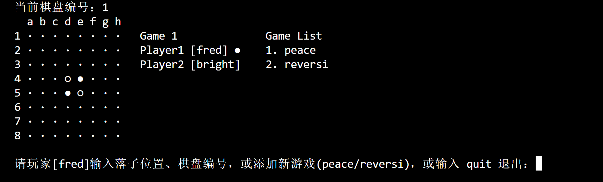
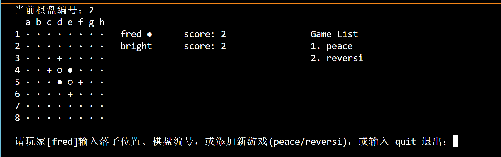
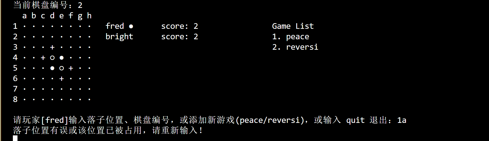
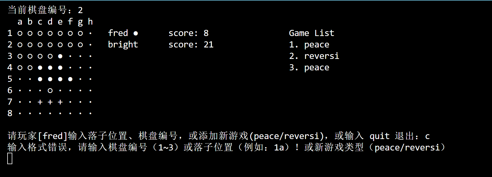
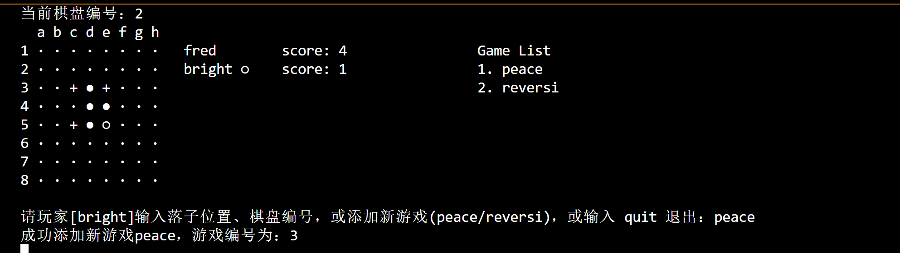
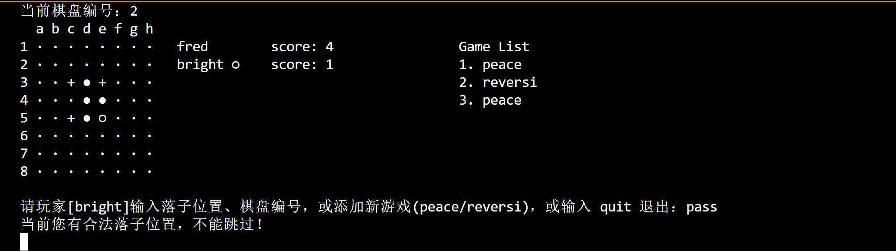
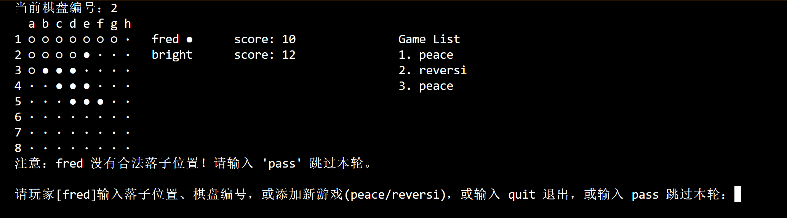
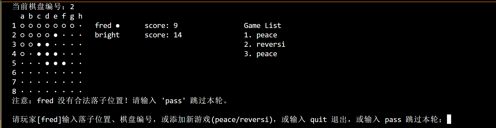
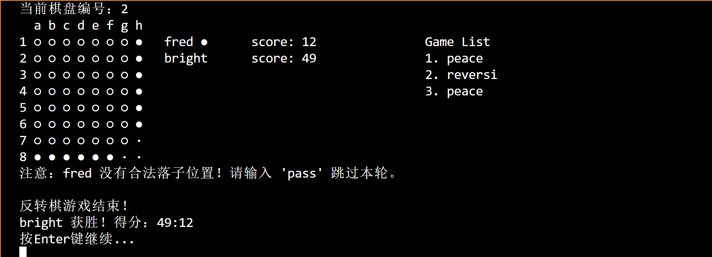
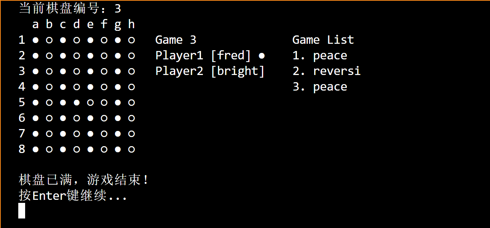

- 黄恩富 23307110170
:vscode编辑器下棋盘内容横向输出对齐正确 但似乎存在编辑器不同会导致格式对齐出现问题的问题 建议使用vscode打开
：落子黑白子受编辑器appearance影响 不过无伤大雅

1. 游戏初始截图：

2. 输入游戏编号完成切换

- 该reversi模式下使用‘+’标记合法落子位置
3. 处理非法落子输入


4. 输入peace或reversi完成新游戏模式的添加

5. reversi模式下 当有合法落子位置 不允许pass

6. 当玩家没有合法落子位置 要求输入pass切换棋权


7. 双方均没有落子位置时reversi游戏结束

8. peace模式棋盘满则游戏结束



## 一、项目概述
本项目是一个包含多种游戏模式（如普通棋盘游戏和反转棋游戏）的控制台游戏程序，通过代码实现游戏流程控制、玩家管理、棋盘操作等功能。以下将对项目中的各个类及其功能进行详细分析。

## 二、文件组织结构
项目的文件组织结构如下：
```
src
└── main
    └── java
        └── com
            ├── board
            │   ├── Board.java
            │   └── ReverseBoard.java
            ├── core
            │   └── Game.java
            └── model
                ├── Piece.java
                ├── Player.java
            └── start_game(游戏启动类)
```
其中，`board` 包存放与棋盘相关的类，`core` 包存放游戏核心控制类，`model` 包存放游戏模型相关类。

## 三、代码分析

### `com.game.model.Piece` 类
- **功能**：定义了棋子类型的枚举类，包含 `BLACK`（黑棋）、`WHITE`（白棋）、`EMPTY`（空）三种类型，并为每种类型提供了对应的符号表示。
- **代码示例**：
```java
package com.game.model;

// 棋子类型枚举
public enum Piece {
    BLACK("●"), WHITE("○"), EMPTY("·");
    private final String symbol;
    Piece(String symbol) { this.symbol = symbol; }
    public String getSymbol() { return symbol; }
}
```

### `com.game.model.Player` 类
- **功能**：用于表示游戏玩家，包含玩家姓名、使用的棋子类型以及得分属性，并提供了相应的访问和修改方法。
- **代码示例**：
```java
package com.game.model;

public class Player {
    private final String name; // 玩家姓名
    private final Piece pieceType; // 玩家使用的棋子类型
    private int score = 2; // 玩家得分

    // 构造函数，初始化玩家姓名和棋子类型
    public Player(String name, Piece pieceType) {
        this.name = name;
        this.pieceType = pieceType;
    }

    // 获取玩家姓名
    public String getName() { 
        return name; 
    }

    // 获取玩家的棋子类型
    public Piece getPieceType() { 
        return pieceType; 
    }

    // 获取玩家得分
    public int getScore() {
        return score;
    }

    // 设置玩家得分
    public void setScore(int score) {
        this.score = score;
    }
}
```


### `com.game.board.ReverseBoard` 类
- **功能**：继承自 `Board` 类，实现了反转棋游戏的特定逻辑。包括检查指定位置是否可落子并翻转对手棋子、更新玩家得分、判断游戏是否结束、获取游戏结果等功能。
- **关键代码示例**：
```java
package com.game.board;

import java.util.Scanner;
import java.util.List;
import com.game.model.Piece;
import com.game.model.Player;

public class ReverseBoard extends Board {
    // 游戏列表

    public ReverseBoard() {
        super();
    }

    // 检查指定位置是否可以落子，同时在符合条件的所有方向上翻转对手棋子
    public boolean canPlaceAndFlip(int row, int col, Piece piece, Player player) {
        // 具体实现逻辑，包括位置合法性判断、棋子翻转等
    }

    // 更新玩家得分 - 直接统计棋盘上该玩家颜色棋子的数量
    private void updatePlayerScore(Player player) {
        // 遍历棋盘统计棋子数量并设置玩家得分
    }

    // 重写 placePiece 方法，只有在可以翻转至少一枚对手棋子的情况下才能落子
    @Override
    public boolean placePiece(int row, int col, Piece piece) {
        // 调用 canPlaceAndFlip 方法判断并落子，更新玩家得分
    }

    // 判断指定位置是否为合法落子（仅检测，不修改棋盘状态）
    public boolean isValidMove(int row, int col, Piece piece) {
        // 具体判断逻辑
    }

    // 检查当前玩家是否存在至少一个合法的落子位置
    public boolean hasValidMove(Piece piece) {
        // 遍历棋盘检查合法落子位置
    }

    // 判断是否允许弃权（跳过落子）
    public boolean canPass(Piece piece) {
        return !hasValidMove(piece);
    }

    // 显示当前棋盘状态
    public void display(Player player1, Player player2, Player currentPlayer, int boardNumber) {
        // 清屏、显示棋盘、玩家信息、合法落子提示等
    }

    // 判断游戏是否结束
    public boolean isGameOver() {
        // 检查棋盘是否已满或双方均无合法落子位置
    }

    // 获取游戏结果，返回获胜玩家或平局信息
    public String getGameResult() {
        // 统计黑白棋子数量判断胜负
    }

    // 重写检查棋盘是否已满并显示游戏结束信息的方法
    @Override
    public void checkGameEnd(Player player1, Player player2) {
        // 判断游戏结束并显示结果，等待用户确认
    }
}
```


### `com.game.core.Game` 类
- **功能**：游戏的核心控制类，负责管理游戏的整体流程。包括初始化游戏（创建棋盘、玩家等）、更新棋盘游戏列表信息、获取游戏类型列表、控制游戏循环（玩家输入处理、落子操作、游戏结束判断等）。
- **关键代码示例**：
```java
package com.game.core;

import com.game.board.Board;
import com.game.board.ReverseBoard;
import com.game.model.Player;
import java.util.ArrayList;
import java.util.List;
import java.util.Scanner;

public class Game {
    // 使用动态列表存储所有棋盘
    private final List<Board> boards;
    // 每个棋盘的独立回合管理列表，0表示由player1落子，1表示由player2落子
    private final List<Integer> boardTurns;
    // 游戏类型列表
    private final List<String> gameTypes;
    // 当前使用的棋盘索引，初始为0
    private int currentBoardIndex = 0;

    private final Player player1;
    private final Player player2;
    private final Scanner scanner;

    public Game(Player player1, Player player2) {
        // 初始化各种列表，创建棋盘，设置玩家等
    }

    // 更新所有棋盘的游戏列表信息
    private void updateBoardsGameList() {
        // 遍历设置每个棋盘的游戏列表引用
    }

    // 获取游戏类型列表
    public List<String[]> getGameTypeList() {
        // 生成包含棋盘编号和游戏类型的列表
    }

    public void start() {
        // 游戏主循环
        boolean running = true;
        boolean allGameEndedNotified = false;
        while (running) {
            // 获取当前棋盘，确定当前玩家，显示棋盘
            Board currentBoard = boards.get(currentBoardIndex);
            Player currentPlayer = (boardTurns.get(currentBoardIndex) == 0)? player1 : player2;
            currentBoard.display(player1, player2, currentPlayer, currentBoardIndex + 1);

            // 检查游戏是否结束
            boolean allEnded = allBoardsFull() || allBoardsGameOver();
            if (allEnded &&!allGameEndedNotified) {
                // 提示所有游戏结束
            } else if (!allEnded) {
                // 重置通知标志
            }

            // 检查反转棋游戏是否结束并处理
            if (currentBoard instanceof ReverseBoard && ((ReverseBoard) currentBoard).isGameOver()) {
                // 等待确认，切换棋盘等操作
            }

            // 获取玩家输入并处理
            String input = scanner.nextLine().trim();
            // 处理退出、pass、添加新游戏、棋盘切换、落子等操作
        }
    }

    // 判断所有棋盘是否均已满
    private boolean allBoardsFull() {
        // 遍历检查每个棋盘是否已满
    }

    // 判断所有棋盘游戏是否都已结束
    private boolean allBoardsGameOver() {
        // 遍历检查每个棋盘游戏是否结束
    }

    // 获取玩家1
    public Player getPlayer1() {
        return player1;
    }

    // 获取玩家2
    public Player getPlayer2() {
        return player2;
    }

    // 获取当前棋盘索引
    public int getCurrentBoardIndex() {
        return currentBoardIndex;
    }
}
```


